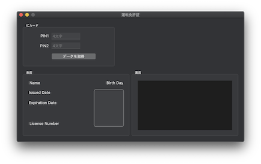

# DriverLicenseApp

これは [CryptoTokenKit Framework](https://developer.apple.com/documentation/cryptotokenkit) を使用して運転免許証の情報を参照する macOS 用アプリケーションです。

このアプリケーションは Swift からスマートカード (ICカード) の各機能にアクセスするサンプルコードを提供する目的で作成しています。
そのため、運転免許証については必要最低限の機能のみ実装してあります。

## 機能
- [x] CryptoTokenKit を使用した スマートカード (ICカード) アクセス
- [x] 運転免許証の記載事項の取得
- [x] 運転免許証の本籍の取得
- [x] 運転免許証の写真の取得
- [x] 運転免許証の変更履歴の取得

## 環境

* macOS 10.14+
* Xcode 10.2+
* Swift 5.0+
* IC カードリーダー

## スクリーンショット

## 使い方

1. ICカードリーダーに運転免許証をセットします
2. アプリを起動して運転免許証発行時に設定した PIN1、PIN2 を入力します
3. 「データを取得」ボタンを押下すると、IC カードから記載事項を取得して画面に表示します

## 作成者

Watanabe Toshinori – toshinori_watanabe@tiny.blue

## ライセンス

このプロジェクトは MIT ライセンスで公開しています。詳しくは [LICENSE](LICENSE) を参照してください。
